Introduction
============

Unity Crash Course aims to teach complete beginners the essential basics of Unity in just 90 minutes. It was written by Marc Lepage in August 2014, and heavily revised in March 2015.

Lesson 0 - About Unity
======================

Concepts learned: Unity overview.

Lesson 1 - Learning the Interface
=================================

Concepts learned: layout, views, scenes, saving.

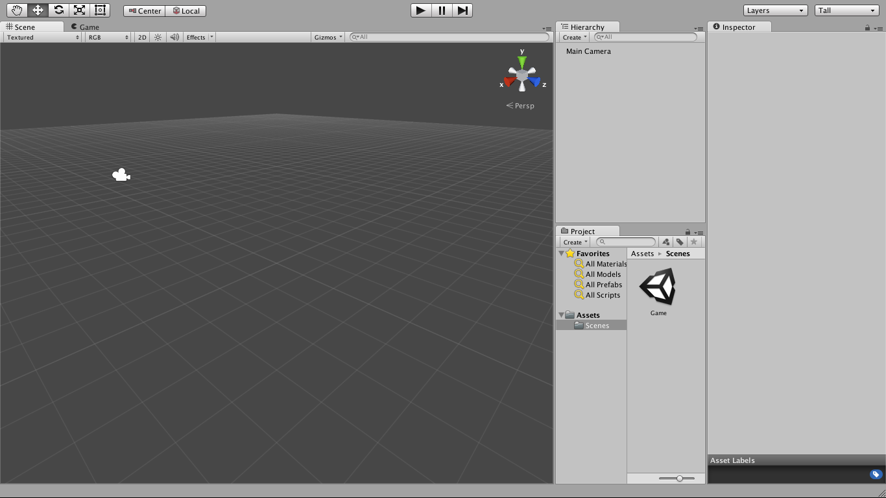

In the Project view, right click on Assets, create a folder, name it "Scenes". In the file menu, save the scene as "Game" in that folder.

Save the scene often, in case Unity should crash, as Unity does not auto save. Also periodically save the project.

Lesson 2 - Creating the Arena
=============================

What you will learn:

* understanding the coordinate system
* creating primitive objects
* resetting transforms
* adjusting position and scale
* duplicating objects

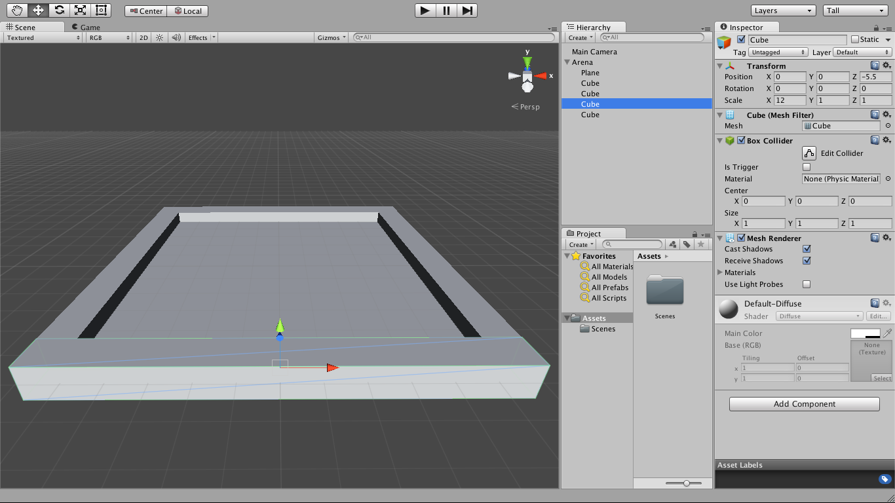

Unity's coordinate system is left-handed. From the perspective of an object, Z is forward, Y is up, and X is right. Rotate the scene view to match.

We want to create an arena consisting of four walls and a floor. While not strictly necessary, our hierarchy will be cleaner if we create an object solely to organize the walls and floor. In the hierarchy, create an empty object and name it "Arena". In the inspector, reset its transform using the gear pulldown.

Now we need a floor. In the hierarchy, select the Arena and right click to create a plane as a child of the arena. In the inspector, its transform should already be reset. The plane extends for 5 units in each direction in the XZ plane.

Now for the left wall. In the hierarchy, select the Arena and right click to create a cube as a child of the arena. Again its transform should already be reset. The cube extends 0.5 units in each direction; change its X position to -5.5 so it's adjacent to the plane. Change its Z scale to 10 so it extends the length of the plane. It does not matter that the cube extends below the plane: it won't matter for gameplay and it won't be visible to the player.

It's easiest to create the right wall by duplicating the left wall. In the hierarchy, select the left wall and right click to duplicate it. All that needs to change in its transform is the X position to 5.5. Alternatively, you could drag it by the red arrow in the scene view while holding command, so it moves in 1 unit increments in the X direction, until it is in the proper position.

Now for the near and far walls. In the hierarchy, select the Arena and right click to create a cube as a child of the arena. Change its Z position to -5.5, and its X scale to 12. Duplicate it and change its Z position to 5.5.

Lesson 3 - Materials
====================

What you will learn:

* creating materials
* adjusting colors
* choosing a shader
* applying a texture

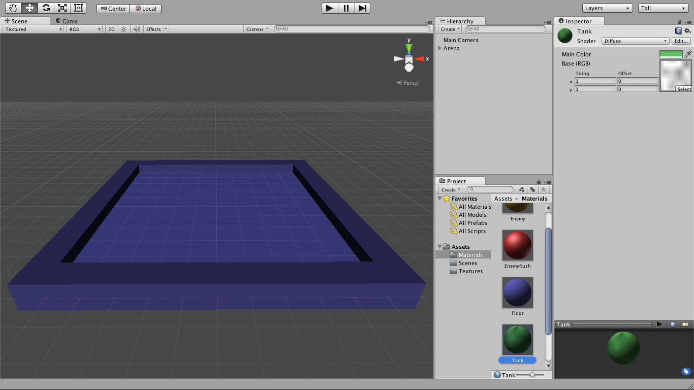

Our arena is colorless. Notice if you select any of its primitive objects (the plane or cubes) they use a material called "Default-Diffuse" which is boring white. Aside from being devoid of fun, it makes it more difficult to work with our objects in the scene view. We'll fix that by creating some colorful materials to apply to our primitive objects.

In the project view, create a new folder named "Materials". In that folder, create a new material named "Floor". Select it, and in the inspector, click on its main color to change it to some shade of blue.

With the materials visible in the project, select the arena's plane in the hierarchy, and drag the floor material onto the inspector. This applies the floor material to the floor object; it should change color appropriately in the scene view.

Create a new material named "Wall" with a different shade of blue. You can quickly apply the material to the four walls by dragging it from the project view directly onto them in the hierarchy or scene views.

Create another material named "Enemy" and make it a shade of yellow. Even without an object, we can preview it in the inspector. With the "Diffuse" shader it looks somewhat flat. That's good for the arena but we want our enemies to stand out. We can use the "Specular" shader which makes it look shiner.

Duplicate the enemy shader and name it "EnemyRush". Change it to a shade of red.

Duplicate one of the enemy shaders again and name it "Tank". Change it to a shade of green. Now we want to make the tank material more interesting by adding a camoflage texture. Typically textures are stored in a folder called "Textures" and a small random black/white texture has been provided. In the tank material's inspector, select it.

Notice that materials are effectively global: if you edit the material in an object's inspector, it edits the material itself, and all objects with that material will change appearance.

Lesson 4 - Creating a Tank
==========================

What you will learn:

* nesting objects
* adjusting rotation

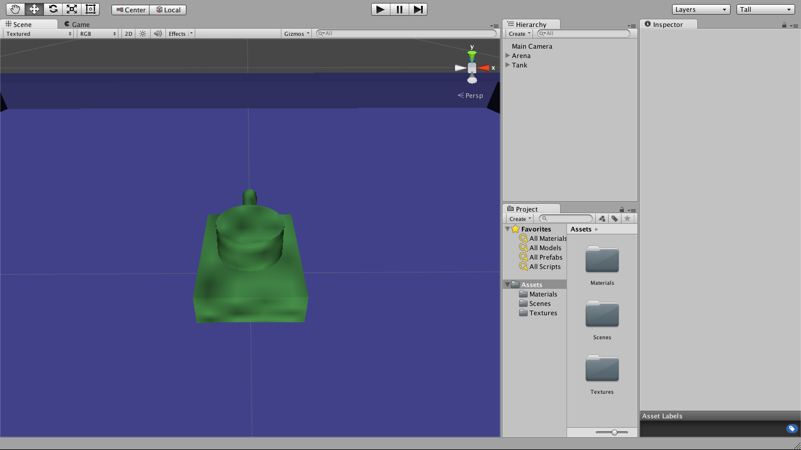

We will create a tank for the player to control. It will consist of a body and a turret with a gun. The gun moves with the turret; the turret rotates in place, and moves with the body.

To accomplish this, we'll nest the objects in a hierarchy so child transforms are relative to those of their parents. We might try a hierarchy like this:

* Tank Body (cube)
  * Turret (cylinder)
    * Gun (cylinder)

However that has a problem. As with the arena, we'll be using primitive objects to construct our tank. These cubes and cylinders will be scaled non-uniformly (i.e. differently in the X, Y, and Z directions) and this will wreak havoc on child rotations, scaling, and colliders.

So instead we'll use a slightly more complicated hierarchy like this:

* Tank (empty)
  * Body (cube)
  * Turret (empty)
    * Turret (cylinder)
    * Gun (cylinder)

Such a hierarchy ensures all parents are uniformly scaled by introducing extra empty objects. This means all non-uniformly scaled objects are childless.

Create an empty object for the tank at the origin and a cube child for its body. The cube should have an X scale of 0.75, a Y scale of 0.25, and a Y position of 0.125 to place it upon the plane. Notice how this allows the tank itself to have a Y position of 0 and still have its body fully above the plane.

Create another empty child of the tank for the turret, and a cylinder as a child of the turret. The cylinder should have an X and Z scale of 0.5, and a Y scale of 0.125 to make it the same height as the body (it's normally 2 units high). To sit upon the body it needs a Y position of 0.375, but instead of applying that to the cylinder, apply it to the turret instead; the cylinder's Y position of 0 will be relative to its parent.

Create another cylinder as a child of the turret. This cylinder needs to be rotated 90 degrees about its X axis so it can play the role of the gun. It should have an X and Z scale of 0.125 and a Y scale of 0.25. Again its Y position should be 0, as it is relative to its parent which is already at the proper height. Its Z position should be 0.375 so it sticks out a bit beyond the body, and it's OK that it penetrates into the turret's cylinder a bit.

Notice how adjusting the Y rotation of the turret rotates the turret cylinder and gun cylinder about the body, and adjusting the X and Z position of the tank moves everything together along the arena floor.

Apply the tank material to the cube and two cylinders so they are appropriately colored.

Lesson 5 - Creating Enemies
===========================

What you will learn:

* working with prefabs

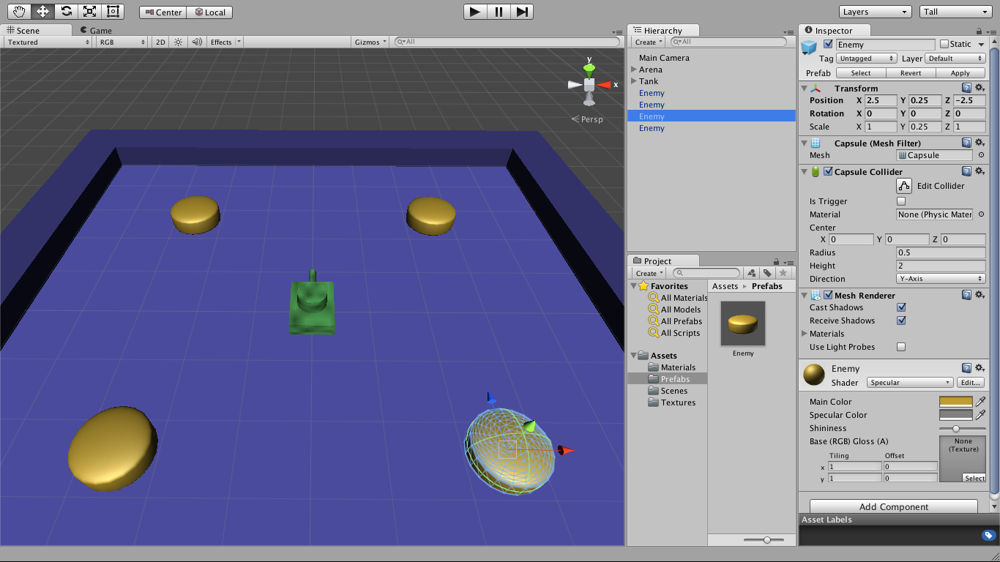

Our enemies will be much simpler in construction.

Create a capsule, name it "Enemy", and give it the enemy material. By default its height is 2, and we want it to be 0.5, so change its Y scale to 0.25 and its Y position to 0.25 so it sits upon the arena floor.

We want to create many enemies, so we will need a way to manage them collectively. If we were to simply duplicate one enemy to make multiple copies, we could adjust the material and all enemies would change appearance, but we wouldn't have an easy way to adjust the scale of all enemies, or give each an antenna, or anything like that.

Prefabs will let us do that. They are typically stored in a folder called "Prefabs", so make one now.

To create a prefab enemy, simply drag it from the hierarchy view to the prefabs folder. (It could be any folder in the project view, but prefabs is a good place.) Then drag three more copies from the prefabs folder onto the scene or hierarchy view. Move each enemy so it is near a corner of the arena.

The enemies are now instances of the prefab. Notice how each is colored blue in the hierarchy. Some of their properties are bold: these are unique to the instance. Others are not bold: these are inherited from the prefab. For example, each instance has its own position and rotation, but gets its scale from the prefab.

Selecting the prefab and changing its scale will change it for all instances. If you select an instance and change its scale, it will change only for that instance, but you can apply that change to the prefab using a button in the inspector.

If you no longer want an object to be an instance of a prefab, you can choose Break Prefab Instance in the GameObject menu.

Lesson 6 - Camera
=================

What you will learn:

* positioning the camera
* changing the background color
* perspective vs. orthographic projection

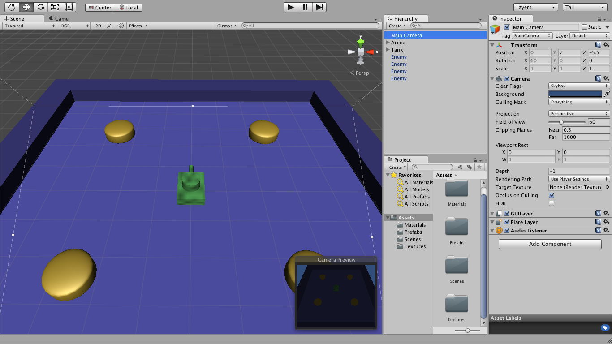

We've mostly been working in the scene view, but that is not what our game will look like. It is cameras which determine the look of the game.

We can have multiple cameras, but it is the main camera that is most important. One was created for us by default. Select it in the hierarchy and notice what happens in the scene view.

First, we get box showing a preview of what the camera sees. Second, we see an outline of the camera view in the scene.

Switch to the game view and confirm it's the same as the preview. Feel free to navigate in the scene view to see the camera from the side, for a behind the scenes view.

We want our main camera to show a nice overhead view of the arena. Set its height (Y position) to about 7 and make it look down (X rotation) by 60 degrees. Move it forward until the arena is nicely visible; a Z position of about -5.5 should be good.

The background color defaults to blue, feel free to change it.

The projection can either be perspective (the default) or orthographic (more like an engineering drawing). Changing the field of view (for perspective) or size (for orthgraphic) has an effect on the visible area.

Depending on the camera's position in the scene, you may also need to adjust the near and far clipping planes to ensure everything is in view.

Lesson 7 - Lights
=================

What you will learn:

* scene view lighting
* creating lights
* types of lights
* changing a light's color and intensity
* enabling shadows

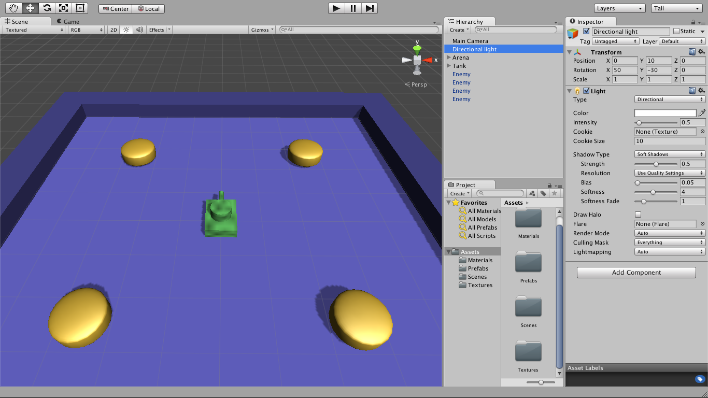

You will have noticed in the game view that the scene looks very dark. In the scene view it looks much better.

This is because the scene view has its own artificial lighting. Try toggling it off and on using the light button above the scene view (between the buttons for toggling 2D/3D and audio). When it's off, the scene view lighting matches the game view.

We need to light our scene. We do this by creating some lights. These are another type of object, and they come in a few types.

In the hierarchy, create a directional light. A directional light points in a specific direction, while its position and distance are irrelevant. It's meant to model a distant and powerful light like the sun. In our case the default rotation is is OK, as if it's coming over our right shoulder, but set its Y position to 10 just to get it out of our way in the scene view.

A point light has the opposite nature: its position and distance are important, but direction is not. It's meant to model something like a bare light bulb or the light from a campfire.

A spot light is somewhat like combining a point light with a directional light. It's meant to model something like a flashlight or lighthouse.

An area light is like a glowing panel or a bank of fluorescent tubes.

Select the directional light and note its properties in the inspector. By default it is white but you can change its color. You can also change its intensity to be stronger or weaker.

Turn on soft shadows. These help to anchor the objects (tank and enemies) in the scene. We don't want them too strong, so adjust the strength to 0.5.

Lesson 8 - Scripts
==================

What you will learn:

* creating C# scripts
* attaching scripts to game objects
* editing scripts with MonoDevelop
* using the debug console
* running the game in the editor

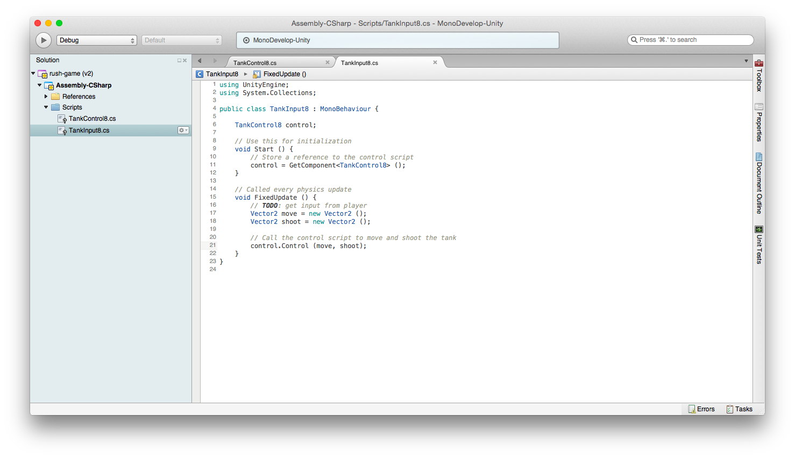

Our game has taken shape, but so far it's static, with no game play. That will change once we start scripting to add behaviour.

Scripts are typically saved in a folder called "Scripts" so create one now. They are compiled and attached to game objects as custom components that you control.

We want to control our tank with player input. But conceptually a tank could just as well be controlled by an AI script. Therefore, it's common to use two scripts: one to control the game object, which is called by another that gets player (or AI) input.

So create one C# script named "TankControl" and another named "TankInput". Drag them onto the tank object in the hierarchy; you should see them appear in the inspector.

Double click on the TankControl script and it will open in MonoDevelop, a C# development environment. You can see a C# class is created with the name "TankControl". (If you ever rename the script file, you'll have to rename this class also.)

Scripts are created with two functions for convenience: Start (called when a game object becomes active), and Update (called every frame).

In TankControl, we won't be using the Update function, so change its name to Control, make it public (so we can call it from another script), and give it two Vector2 arguments for moving and shooting. Add a debug statement to log those arguments to the console. Leave the Start function empty for now.

    public void Control (Vector2 move, Vector2 shoot) {
        Debug.Log ("move: " + move + " shoot: " + shoot);
    }

In TankInput, we want to call the TankControl script attached to the same game object, so we'll need a reference to it. Make a member variable of the appropriate type:

    TankControl control;

In the Start function, call GetComponent with the appropriate type to get the reference:

    void Start () {
        control = GetComponent<TankControl> ();
    }

Now, we don't want to control the tank every frame, because it's a physical object, so it should only be affected by input when the physics engine updates. So change the Update function's name to FixedUpdate. In it, we'll create two Vector2 objects and pass them to the control script.

    void FixedUpdate () {
        Vector2 move = new Vector2 ();
        Vector2 shoot = new Vector2 ();
        control.Control (move, shoot);
    }

Save the scripts and go back into Unity. From the Window menu, open the Console and drag its tab so it's beside the game and scene views. If there are any compile errors, they will appear here and you'll have to fix them in MonoDevelop before proceeding.

We can run the game from within the editor. This is very effective for testing how our scripts behave. Press the play button in the top center of the Unity editor. The game view will show (either maximized or not). We can pause and single step if we wish.

Our debug log statements will appear in the bottom of the Unity editor, and also in the console. You should see the move/shoot log statement is being called many times a second.

Lesson 9 - Input APIs
=====================

What you will learn:

* APIs for handling input
* using the asset store
* using the download manager

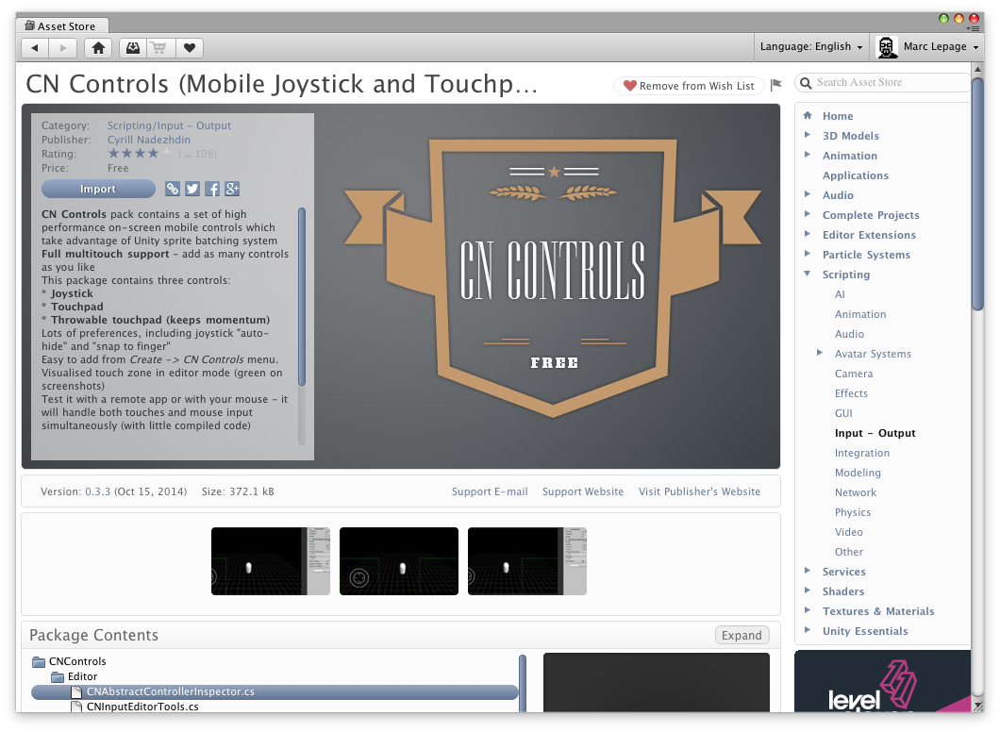

We have several options for obtaining player input.

Using the built-in "Input" API, we can get key, joystick, mouse, touch, and accelerometer events fairly easily. However, it lacks mobile controls (e.g. virtual joysticks and touch pads) and requires a lot of custom code and configuration to support diverse input devices (e.g. the many game controllers on the market).

Unity also provides a newer "CrossPlatformInput" API which is mostly a drop-in replacement for Input, but with improvements. Its mobile controls are adequate, but require the use of a separate "Unity Remote" app to easily test while running in the editor. And it doesn't handle all the game controllers. There are better options.

The best library for handling input is an API called "InControl". The free open source version handles virtually all of the game controllers. You'll have to purchase the paid version to use the mobile controls, but it's worth $25.

For now we'll use another free open source library called "CN Controls". It only provides mobile controls (e.g. virtual joystick and touch pad), but they work with the mouse in the editor.

From the Window menu, open the Asset Store. Create an account and log in. You should see assets which you can inspect right in the browser. There are usually sales, and favouriting assets is a good way to bookmark interesting ones for later.

Search for "CN Controls" and you should find a free version. Click download, then import. You can choose which parts of the asset to import; for now just import it all into the project.

Later, you will be able to go into the download manager (in the asset store) to manage downloads and updates.

Reference:

* [Input (API)](http://docs.unity3d.com/ScriptReference/Input.html)
* [CrossPlatformInput (asset store)](https://www.assetstore.unity3d.com/en/?gclid=COrp25iwkMQCFQozaQod3iIApQ#!/content/21064)
* [InControl (asset store)](https://www.assetstore.unity3d.com/en/?gclid=CP3Mz5GukMQCFQyUaQodVHAADg#!/content/14695)
* [CN Controls (asset store)](https://www.assetstore.unity3d.com/en/?gclid=CP3Mz5GukMQCFQyUaQodVHAADg#!/content/15233)

Lesson 10 - Handling Player Input
=================================

What you will learn:

* using CN Controls for joystick input
* changing a script's execution order
* assigning references in the editor

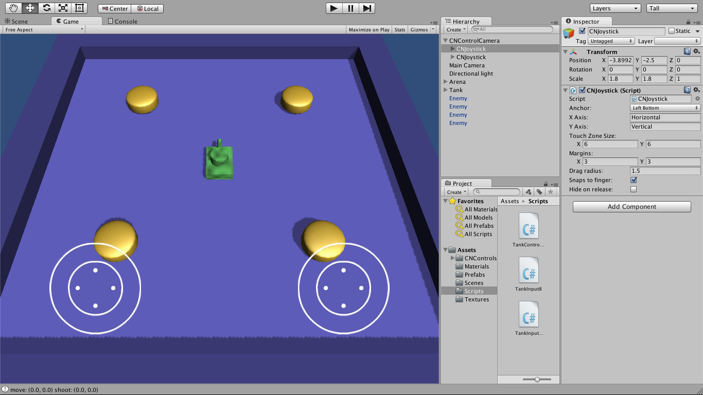

We've imported the CN Controls library into our project, but we still have to use it within our game.

In the hierarchy, under Create Other, create a CN Controls Joystick. It will appear in the hierarchy view as a CNJoystick under a CNControlCamera. You should see it in the game view, and if you run the game, it should react to mouse events.

Create another joystick and change its anchor to right bottom. Now we have a left and right stick. The left stick will move the tank, and the right will shoot.

One more thing: we'll have to ensure the virtual joysticks update before we try to read their values. We do this by setting a low negative number for the script's execution order. In the edit menu, under project settings, script execution order, we can see this has already been done for us: the value for CNAbstractController is -100.

Now open the TankInput script. Add two public variables to hold references to the joystick objects we just created.

    public CNAbstractController moveStick;
    public CNAbstractController shootStick;

We won't set these references in code. Because they are public, they will appear in the inspector. Save the scripts and go back into the editor, select the tank, and you should see them in the inspector. Drag the left stick from the hierarchy onto "Move Stick". For "Shoot Stick", click the circle select button and assign the right stick from a list of appropriate game objects. Now Unity will maintain these references when it instantiates the script component for the game object.

All that remains is to use the joystick input in the TankInput script's FixedUpdate function. This is relatively easy:

        Vector2 move = new Vector2 (moveStick.GetAxis ("Horizontal"), moveStick.GetAxis ("Vertical"));
        Vector2 shoot = new Vector2 (shootStick.GetAxis ("Horizontal"), shootStick.GetAxis ("Vertical"));

Run the game and you should see the stick values in the console as you use them.

Reference:

* [CN Controls overview and installation guide](rush-game/Assets/CNControls/README.pdf)
* [CN Controls overview video](https://www.youtube.com/watch?v=w5oKjwkNevk)

Lesson 11 - Tank Movement
=========================

What you will learn:

* rigid body physics
* moving a rigid body
* rotating a rigid body
* colliders

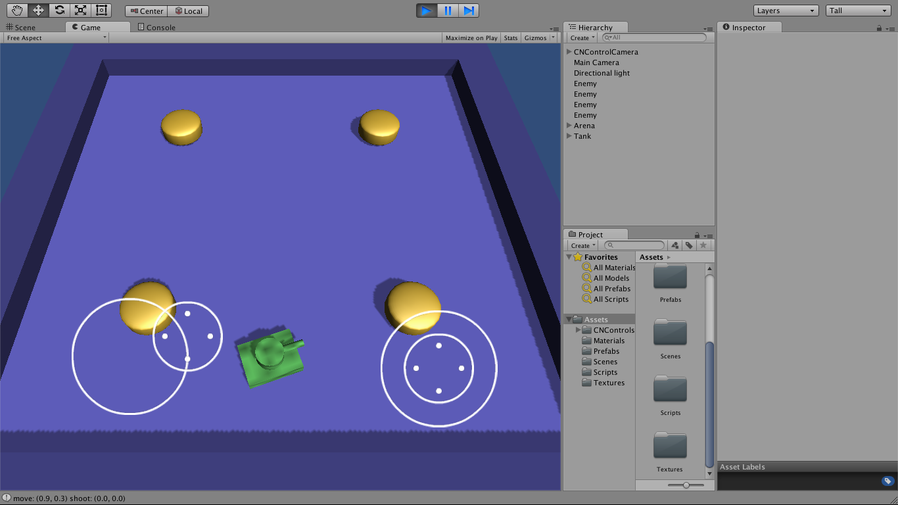

We are now ready to move our tank according to player input.

Open the TankControl script. We'll want a configurable speed for our tank, so add a public member variable:

    public float speed = 1f;

Our tank will default to 1 unit per second, but we can adjust that later in the inspector and Unity will use whatever value we set instead of the script's hardcoded value.

In the Control function, we'll want to move the tank, but only if the stick has moved.

    if (0f < move.sqrMagnitude) {
        rigidbody.MovePosition (rigidbody.position + new Vector3 (move.x, 0f, move.y) * speed * Time.fixedDeltaTime);
    }

The tank is moved by taking its current physical position, adding the distance it has moved over the time of the physics update, and using that to set its new physical position. The distance moved is the (already normalized) input movement vector, converted from 2D (XY) to 3D (XZ), scaled by the tank's speed over the time period.

The rigidbody is a component attached to the game object that performs physics updates. If we were to run the game now, it would crash, as our tank object has no rigidbody component attached to it. So select the tank and add one (under Physics, not Physics 2D).

Run the app and you should see it bounce around according to left stick input. It should not go through the floor, walls, or enemies. However, it's possible to flip the tank or even make it exit the arena, and another issue is the tank may move or spin without stick input at all.

The bounce can be eliminated in the rigidbody by freezing the Y position and the X and Z rotation (under constraints). The aimless movement and spinning can be eliminated by setting drag and angular drag to infinity. Finally, we can uncheck Use Gravity since our gameplay is restricted to the XZ plane.

These settings make our tank movement a lot smoother, but it still doesn't point in the proper direction. Let's fix that.

First, in the TankInput Control function, in the if statement, use a little bit of trigonometry to determine the angle of rotation in degrees.

    float a = Mathf.Atan2 (move.x, move.y) * Mathf.Rad2Deg;

Then rotate the tank by setting its physical rotation using that angle (relative to the up axis).

    rigidbody.MoveRotation (Quaternion.AngleAxis (a, Vector3.up));

Run the game and the tank should now point in the direction it is travelling.

So how does the rigid body know how to move physically in a scene? By default, each of the primitive objects has a collider which defines its physical presence in the world. Since we composed our scene (floor, walls, enemies, tank) from primitives, they have a phyiscal presence. The rigidbody component then dictates how these colliders react in the physics engine.

Our tank has several primitive components, but for movement, we only care about the collider on the body cube. We have no need or desire for colliders on the cylinders (turret and gun), so disable or remove them.

Lesson 12 - Enemy Movement
==========================

What you will learn:

* controlling enemy behaviour from a script

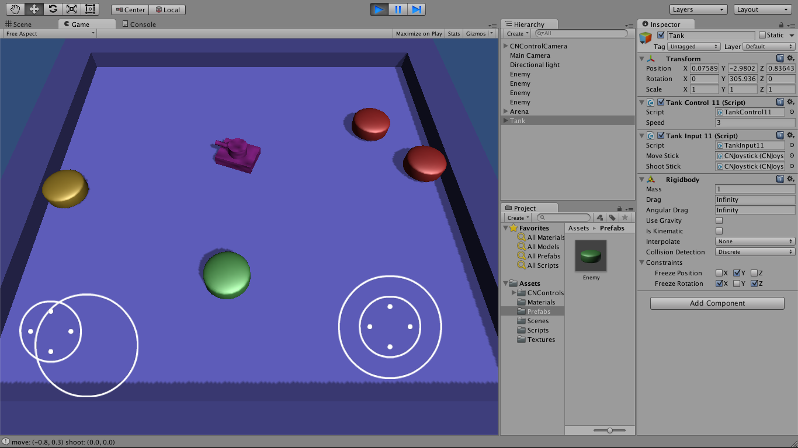

Our enemies will have very simple behaviour. They will cycle through three states: idle, warn, and rush.

When idle, they are immobile, vulnerable, and therefore green. Then they change to a warn state, which remains immobile but is invulnerable, so yellow. Finallly they change to a rush state, which is invulnerable and mobile, so red. Then back to idle.

One script (Enemy) will suffice. It will operate just like the tank control script: moving the position of the object's rigid body in FixedUpdate. Instead of input, it will be controlled by the states, which are just member variables which vary over time with a little randomness.

Consult the finished script for details. It should be added to the enemy prefab.

The enemy prefab still needs some configuration. It needs a rigidbody component, configured just like tank's. The three enemy materials have to be hooked up to the script, so the color can change with the state.

And one more thing. Because of the shape of the colliders on the heavily squished capsules, they intersect with the arena floor's collider. This means they will prevent the enemies from moving properly. The easiest fix, because our gameplay is restricted to the XZ plane and we've disabled gravity, is to simply remove the collider from the arena floor.

Run the game and you should see the enemies change color and move around, occasionally bumping into each other or the tank.

Lesson 13 - Collisions
======================

What you will learn:

* detecting and handling collisions
* comparing tags
* destroying objects

We want the enemy to be dangerous to the player's tank. It should destroy the tank whenever they come into contact.

We can do this by detecting collisions between colliders. This only works if at least one of the colliding objects has a collider, but that is the case.

So add function OnCollisionEnter to the enemy script:

    void OnCollisionEnter (Collision collision) {
        Debug.Log ("player hit?");
    }

If you run this code, you'll find it detects when an enemy hits the player, but also when an enemy hits another enemy, or a wall. We need handle the collision a little more carefully.

The easiest check to perform is against the tag of the colliding object. There is already a "Player" tag, so we'll use that.

    void OnCollisionEnter (Collision collision) {
        if (collision.collider.CompareTag ("Player")) {
            Debug.Log ("player hit!");
        }
    }

It still won't work until we tag the tank's body object as "Player" (in its transform component). Tagging is useful, and we can create our own tags if we desire.

Normally, at this point we'd play a sound, reduce the tank's health or life, possibly even declare the game to be over. That is left as an exercise for the reader.

Lesson 14 - Tank Shooting
=========================

What you will learn:

* finding objects by name
* instantiating objects

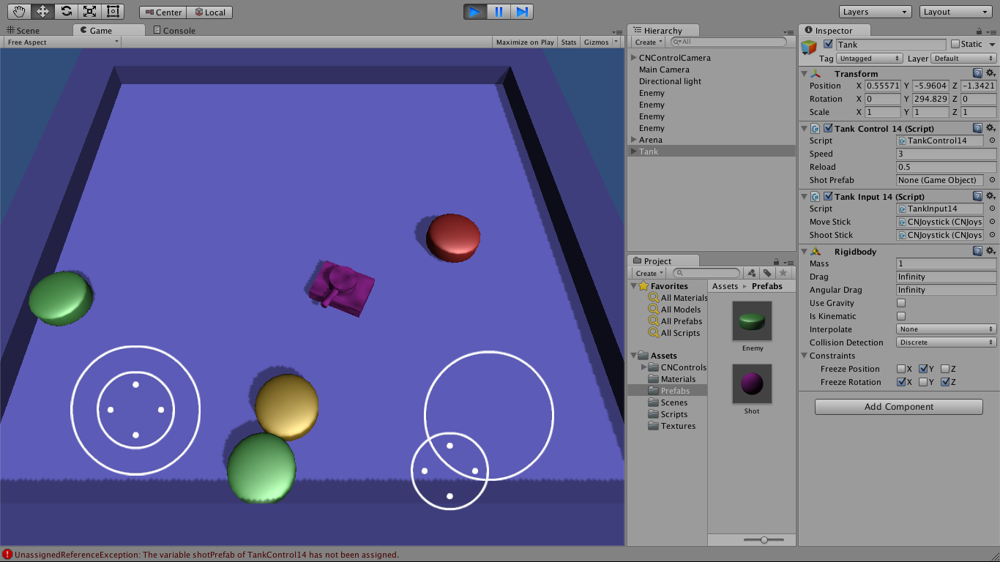

We haven't yet made our right stick shoot. Let's enhance our TankControl script to do this.

First, we'll need the turret and gun objects. Make some member variables to store them.

    GameObject turret;
    GameObject gun;

Then get them by name in the Start function. This is brittle in the face of hierarchy changes, but easy. Notice how you can search the hierarchy like a path name.

    void Start () {
        turret = transform.FindChild ("Turret").gameObject;
        gun = transform.FindChild ("Turret/Gun").gameObject;
    }

We'll want to limit our firing rate. First make some member variables to configure and keep track of reload time.

    public float reload = 0.5f;
    float reloadTime = 0f;

Now we are ready to enhance the Control function to shoot.

We want to rotate the turret in a manner very similar to how we rotated the tank body, except we don't care about physics. So we'll rotate the turret's transform, instead of its rigid body (which it doesn't have).

Additionally, we'll keep track of reload time, and only shoot if the time is right. We'll shoot by calling another function with the shot's angle.

    if (0f < reloadTime) {
        reloadTime -= Time.fixedDeltaTime;
    }
    if (0f < shoot.sqrMagnitude) {
        float a = Mathf.Atan2 (shoot.x, shoot.y) * Mathf.Rad2Deg;
        turret.transform.rotation = Quaternion.AngleAxis (a, Vector3.up);
        if (reloadTime <= 0f) {
            Shoot (a);
            reloadTime = reload;
        }
    }

We'll need a shot to shoot. This will require a prefab which we'll hook up in the editor.

    GameObject shotPrefab;

Now we're ready to write our Shoot function. We'll do this by instantiating a clone of the shot prefab object. It will be instantiated at the gun's position, with the desired rotation.

    void Shoot (float a) {
        Instantiate (shotPrefab, gun.transform.position, Quaternion.AngleAxis (a, Vector3.up));
    }

We've done everything needed in the tank, but we're not done yet. If you run the game, you'll get exceptions because there is no shot prefab. That's next.

Lesson 15 - Shots
=================

What you will learn:

* changing a rigid body's velocity
* destroying objects

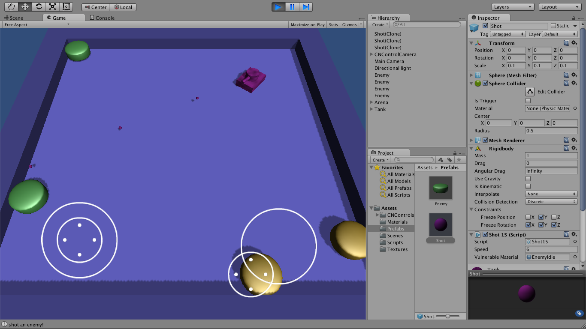

Let's make a shot.

In the editor, create a sphere, reset its transform, and set its X, Y, and Z scale to 0.1. Rename it "Shot" and drag it into the "Prefabs" folder. On the tank object, attach the shot prefab to the TankControl script.

Now we can move and shoot, but the shots do nothing. To move them with physics, we'll first need to add a rigid body component to the shot prefab object. Disable gravity and freeze its Y position as before. Freeze all rotation, and set angular drag to infinity. This time however, set drag to 0 so we can move the shot with forces.

Create a new C# script named "Shot" and attach it to the shot prefab object.

Give it a public member variable to configure the shot speed.

    public float speed = 6f;

Then, in the Start function, change the velocity of the shot's rigid body so it moves on its own.

    void Start () {
        rigidbody.velocity = transform.forward * speed;
    }

At this point, the tank can shoot, and the shots will bounce off other colliders, but they won't do anything interesting. We need to handle collisions.

There are many ways we could tell what collided with the shot. In this case, it suffices to compare materials as only the EnemyIdle material is vulnerable.

So create a public member variable.

    public Material vulnerableMaterial;

Configure it in the editor with the EnemyIdle material.

Finally, check against it in the OnCollisionEnter function.

    void OnCollisionEnter (Collision collision) {
        if (collision.collider.gameObject.renderer.sharedMaterial == vulnerableMaterial) {
            Debug.Log ("shot an enemy!");
        }
        Destroy (gameObject);
    }

If we shot an enemy, we might want to play a sound, trigger an explosion, increase our score, leave a power-up, etc.

Regardless of what we hit, the shot is destroyed. It's important to call Destroy(gameObject) and not Destroy(this), as the latter destroys the script while leaving the game object alive.

Lesson 16 - Audio
=================

TODO, in the meantime see [Karmbat](https://github.com/mlepage/karmbat).

References:

* [Bfxr](http://www.bfxr.net/)
* [Audacity](http://audacity.sourceforge.net/)

